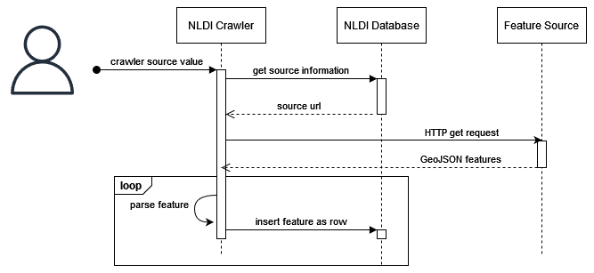

# NLDI Crawler

[](https://github.com/internetofwater/nldi-crawler/actions/workflows/spotless.yml)
[](https://codecov.io/gh/internetofwater/nldi-crawler)

The Crawler is used to ingest data and link it to the network if it is not already. The only requirement is that the source system
is able to provide GeoJSON via a web request with necessary attributes. A database table (`nldi_data.crawler_source`) contains metadata about the
GeoJSON. We can link data to the network via latitude/longitude coordinates or NHDPlus reachcode and measure.

## Table of Contents

- [Contributing](#contributing)
- [Developer Environment](#developer-environment)
  - [Configuration](#configuration)
  - [Dependencies](#dependencies)
  - [Testing](#testing)
- [Running the Crawler](#running-the-crawler)
  - [Maven](#maven)
  - [JAR File](#jar-file)
  - [Docker](#docker)
- [Sequence Diagram](#sequence-diagram)

## Contributing

Contributions can be made via [pull request to this file](https://github.com/internetofwater/nldi-db/blob/master/liquibase/changeLogs/nldi/nldi_data/update_crawler_source/crawler_source.tsv).

Current `nldi_data.crawler_source` table fields:

| Column Name       | Column Description                                                                                                                                                                                              |
|-------------------|-----------------------------------------------------------------------------------------------------------------------------------------------------------------------------------------------------------------|
| crawler_source_id | An integer used to identify the source when starting the crawler source.                                                                                                                                        |
| source_name       | A human-oriented name for the source.                                                                                                                                                                           |
| source_suffix     | The suffix to use in NLDI service urls to identify the source.                                                                                                                                                  |
| source_uri        | A uri the crawler can use to retrieve source data to be indexed by the crawling method.                                                                                                                         |
| feature_id        | The attribute in the returned data used to identify the feature for use in NLDI service urls.                                                                                                                   |
| feature_name      | A human readable name used to label the source feature.                                                                                                                                                         |
| feature_uri       | A uri that can be used to access information about the feature.                                                                                                                                                 |
| feature_reach     | **Conditionally Optional** The attribute in the source feature data where the crawler can find a reachcode.                                                                                                     |
| feature_measure   | **Conditionally Optional** The attribute in the source feature data where the crawler can find a measure to be used with the reachcode. (strings are parsed into numbers if measure is represented as a string) |
| ingest_type       | Either `reach` or `point`. If `reach` then the feature_reach and feature_measure fields must be populated.                                                                                                      |

## Developer Environment

[nldi-db](https://github.com/internetofwater/nldi-db) contains everything you need to set up a development database
environment. It includes a demo database with data for the Yahara River in Wisconsin.

### Configuration

To run the Crawler project you will need to create an application.yml file in the projects root directory and add the
following:

```yml
nldiDbHost: <hostNameOfDatabase>
nldiDbPort: <portNumberForDatabase>
nldiDbUsername: <dbUserName>
nldiDbPassword: <dbPassword>
```

### Dependencies

Project dependencies can be downloaded through your preferred IDE or command line utility.

For maven you can use the following command.

```shell
mvn dependency:resolve
```

### Testing

This project contains unit and integration tests.

To run unit tests, use the following command.

```shell
mvn test
```

To run integration tests, you will need to have Docker install on your system, the you can use the following command.

```shell
mvn verify
```

## Running the Crawler

There are several options to run the Crawler depending on your preferences or development environment.

### Maven

To run with maven, use the following command replacing `<crawler_source_id>` with the intended integer ID.

```shell
mvn spring-boot:run -Dspring-boot.run.arguments="<crawler_source_id>"
```

### JAR File

After packaging the project, you can run the JAR file directly with the following command.

```bash
java -jar target/nldi-crawler-<build version>.jar <crawler_source_id>
```

Refer to the `target` directory to determine the build version.
For further instructions on running the Crawler via JAR file, see [RUNNING.md](RUNNING.md).

### Docker

To run via Docker Compose, create a `secrets.env` file with the following format:

```yml
nldiDbHost: <hostNameOfDatabase>
nldiDbPort: <portNumberForDatabase>
nldiDbUsername: <dbUserName>
nldiDbPassword: <dbPassword>
```

and run with:

```shell
docker-compose run -e CRAWLER_SOURCE_ID=<crawler_source_id> nldi-crawler
```

## Sequence Diagram

The image below is a sequence diagram detailing how the NLDI crawler operates.



An internal user starts the crawler with an input source value. The crawler gathers information from the database for that source. A `GET` request to the source URL is made to get the target GeoJSON features. That collection of features is then looped through and each one is added as a row to a database table specific to the feature source.
